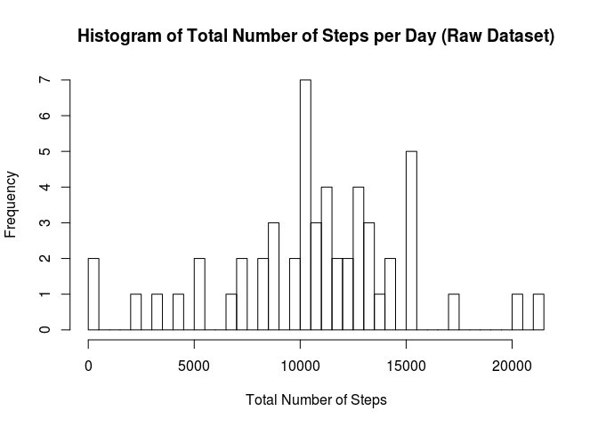
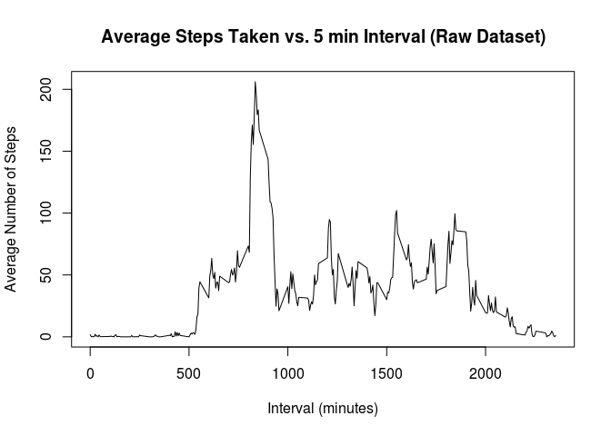
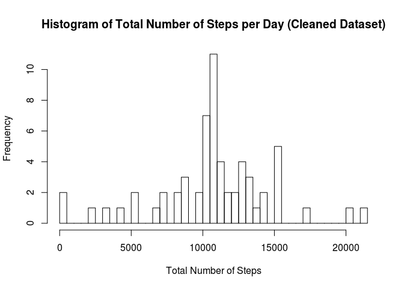
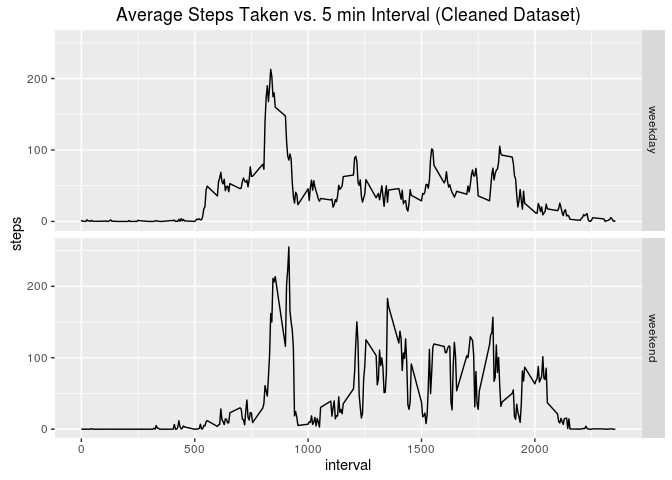

# Reproducible Research: Peer Assessment 1
Adrien Atallah  

<BR>

## Loading and preprocessing the data

We'll read in the raw data file "activity.csv" and change the class of the date variable.

```r
raw <- read.csv("activity.csv") 
raw$date <- as.Date(raw$date) 
```


<BR>

## What is the mean total number of steps taken per day?

Let's calculate the sum of the number of steps taken each day and draw a histogram.

```r
totsteps <- aggregate(steps ~ date, data = raw, FUN = "sum")
hist(totsteps$steps, breaks = 50, xlab = "Total Number of Steps", main = "Histogram of Total Number of Steps per Day (Raw Dataset)")
```



Looks like the mean and median probably lie somewhere just over 1000, let's check.  

```r
mean(totsteps$steps)
```

```
## [1] 10766.19
```

```r
median(totsteps$steps)
```

```
## [1] 10765
```

<BR>

## What is the average daily activity pattern?
Let's first calculate the average number of steps for each 5 minute interval and draw a time series plot.

```r
avsteps <- aggregate(steps ~ interval, data = raw, FUN = "mean")
plot(avsteps$interval, avsteps$steps, type = "l", xlab = "Interval (minutes)", ylab = "Average Number of Steps", main = "Average Steps Taken vs. 5 min Interval (Raw Dataset)")
```



Looks like there is a peak in the number of steps somewhere around the 800 minute interval, perhaps it's a daily run.  Let's see exactly which 5 minute interval had the maximum number of average steps taken.

```r
avsteps[avsteps$steps == max(avsteps$steps),]$interval
```

```
## [1] 835
```

<BR>


## Imputing missing values  
First, let's see how many missing values we have.

```r
sum(is.na(raw))
```

```
## [1] 2304
```

Okay, that's quite a bit and that can have an affect our analysis, so let's replace all those missing values with their averages for the corresponding time interval.  We'll do this by merging the two data frames (raw and averaged by time interval) and then replacing each NA with it's average for that interval.

```r
df <- merge(raw, avsteps, by = "interval", sort = FALSE)
names(df)[c(2,4)] <- c("steps" , "steps_avg")
df$steps[is.na(df$steps)] <- df$steps_avg[is.na(df$steps)]
```

Now, let's create a new "clean" dataframe identical to the raw dataset with the NA values replaced.

```r
clean <- df[, c(2, 3, 1)]
clean <- clean[order(clean$date),]
```

How does this compare to the raw dataset?
Let's calculate the total number of steps per day and draw a histogram.

```r
cleantotsteps <- aggregate(steps ~ date, data = clean, FUN = "sum")
hist(cleantotsteps$steps, breaks = 50, xlab = "Total Number of Steps", main = "Histogram of Total Number of Steps per Day (Cleaned Dataset)")
```



Now, let's calculate the mean and median of the clean data set.

```r
mean(cleantotsteps$steps)
```

```
## [1] 10766.19
```

```r
median(cleantotsteps$steps)
```

```
## [1] 10766.19
```
What's the difference between the raw and clean datasets' mean and median?

```r
mean(totsteps$steps) - mean(cleantotsteps$steps)
```

```
## [1] 0
```

```r
median(totsteps$steps) - median(cleantotsteps$steps)
```

```
## [1] -1.188679
```
Interesting, the mean's are the same but the median seems to have been shifted up. 

<BR>


## Are there differences in activity patterns between weekdays and weekends?

To answer this, we'll first create a new factor variable with 2 levels, "weekend" and "weekday" corresponding to whether each day is during the week or weekend.

```r
clean$day <- as.POSIXlt(clean$date)$wday
clean[clean$day > 5,]$day <- "weekend"
clean[clean$day <= 5,]$day <- "weekday"
clean$day <- as.factor(clean$day)
```

Next, we'll calculate the average number of steps for each interval during the week and during the weekend.  Then we'll make a time series plot of both to see if we can spot some differences.

```r
avstepsdays <- aggregate(steps ~ interval + day, data = clean, FUN = "mean")
library(ggplot2)
print(qplot(interval, steps, data = avstepsdays, facets = day ~., geom = "line", main = "Average Steps Taken vs. 5 min Interval (Cleaned Dataset)"))
```



It looks like there are more steps being taken on the weekends.  Let's compare the overall totals.

```r
tot_wday <- sum(avstepsdays[avstepsdays$day == "weekday", ]$steps)
tot_wend <- sum(avstepsdays[avstepsdays$day == "weekend", ]$steps)
tot_wday - tot_wend
```

```
## [1] -1781.758
```

Yep!  They have taken almost 1800 more steps on average during the weekend!
